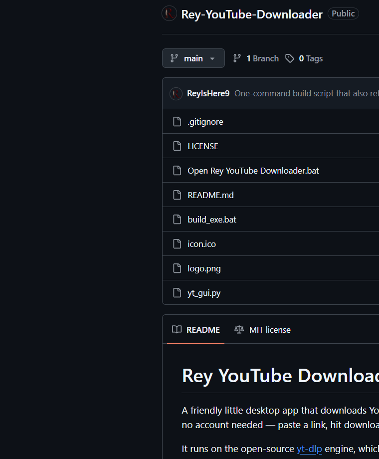

# Rey YouTube Downloader

A friendly little desktop app that downloads YouTube videos, music and
subtitles for you. No sketchy websites, no ads, no account needed — paste a
link, hit download, done.

It runs on the open-source [yt-dlp](https://github.com/yt-dlp/yt-dlp) engine,
which does all the heavy lifting behind the scenes, and gives it a simple,
dark YouTube-style interface.




---

## What it can do

- **Grab a video** as a normal MP4 (picture + sound together) — the everyday
  download.
- **Get just the video track** with no sound, if you want to use it in an
  editor later.
- **Extract music only** as `mp3`, `m4a`, `opus` or `wav`.
- **Download subtitles** — either embedded right into the MP4 or saved as
  separate `.srt` / `.vtt` / `.ass` files you can open in Notepad.
- **Pick a quality cap** — from Best down to 360p, so you can save space.
- **Handle playlists & multi-video links sensibly.** A "preview" step lists
  every video a link points to, so you can untick the ones you don't want
  before anything downloads. No surprises.

You can tick several options at once (say, MP4 *and* audio-only) and it'll
produce all of them in one go.

## How it behaves

- **It's fully portable.** The app never installs anything or touches folders
  outside its own location. Saved videos go into a `Downloads` folder right
  next to the app (you can change that in the GUI).
- **It takes care of its own engine.** On startup it checks that `yt-dlp` is
  around. If it's missing, it asks you and downloads the official `yt-dlp.exe`
  into the app folder for you — nothing for you to configure.
- **It shows you what's happening.** Real progress bar, current file name, and
  a small activity log (green = good, yellow = warnings, red = problems).

## Requirements

- Windows.
- To run the prebuilt app: nothing. Just the `.exe`.
- To run from source instead: Python 3.9+ (no extra packages needed).
- **ffmpeg (recommended)** — needed for MP4 merging, audio extraction and
  embedding thumbnails/subtitles. Install once with:

  ```
  winget install Gyan.FFmpeg
  ```

  Without it, basic "single-file" downloads still work, but the extras won't.

---

## Getting started

### The easy way (recommended)

1. Download `ReyYouTubeDownloader.exe` from the **Releases** page.
2. Drop it in any folder you like — it'll create its own `Downloads` folder
   next to itself.
3. Double-click. If you placed `yt-dlp.exe` beside the exe it starts
   instantly; otherwise it grabs that file once on first launch (about 18 MB).

> **Portable package:** each release also ships a `portable` zip with the
> `.exe` **and** `yt-dlp.exe` together, so it needs no first-run download.
> The portable folder is a build output — it's generated on your machine by
> `build_exe.bat` and published as a release attachment, never committed to git.

### Running from source

```bat
git clone https://github.com/<you>/Rey-YouTube-Downloader.git
cd Rey-YouTube-Downloader
python yt_gui.py
```

(Windows users can also just double-click `Open Rey YouTube Downloader.bat`.)

### Daily use in 20 seconds

1. Paste a link (or several, one per line).
2. Click **Preview titles** to see what it points to.
3. Untick anything you don't want.
4. Tick what to get: **MP4**, **Video only**, **Audio only**.
5. Choose your audio format (see the cheat-sheet below) if extracting music.
6. Optionally tick **Subtitles**.
7. Hit **Download** and watch it go.

## Picking an audio format for music

| Pick        | When to use it                                        |
| ----------- | ----------------------------------------------------- |
| `mp3`       | Default choice — plays literally everywhere            |
| `m4a`       | Slightly better sound per megabyte (AAC)              |
| `opus`      | Best quality, but some older players won't play it    |
| `wav`       | No compression, enormous files — only for editing     |
| `original`  | Keep YouTube's audio exactly as-is, no conversion     |

## The logo

The maroon **R** monogram (with its curling tail and the quill feather tucked
behind the letter) ships as a ready-to-use asset, so it works out of the box:

- **`logo.png`** — used as the logo in the app header and here.
- **`icon.ico`** — used as the app / `.exe` icon.

## Making your own .exe (for developers)

The app only uses Python's built-in libraries, so packaging it is simple:

```bat
python -m pip install pyinstaller
build_exe.bat
```

`build_exe.bat` prepares the logo/icon assets, then builds the single-file
executable (with the maroon-R icon) into `dist\ReyYouTubeDownloader.exe`.

## Small print

- Please only download things you have the right to, and respect the sites you
  use. The app is a download tool — it doesn't host or re-upload anything.
- Very long playlists: the preview list stops at the first 250 entries to keep
  the app snappy.
- This project wraps `yt-dlp`, which has its own license — see
  [yt-dlp's repo](https://github.com/yt-dlp/yt-dlp#license).

## License

[MIT](LICENSE). Do what you like with it.
